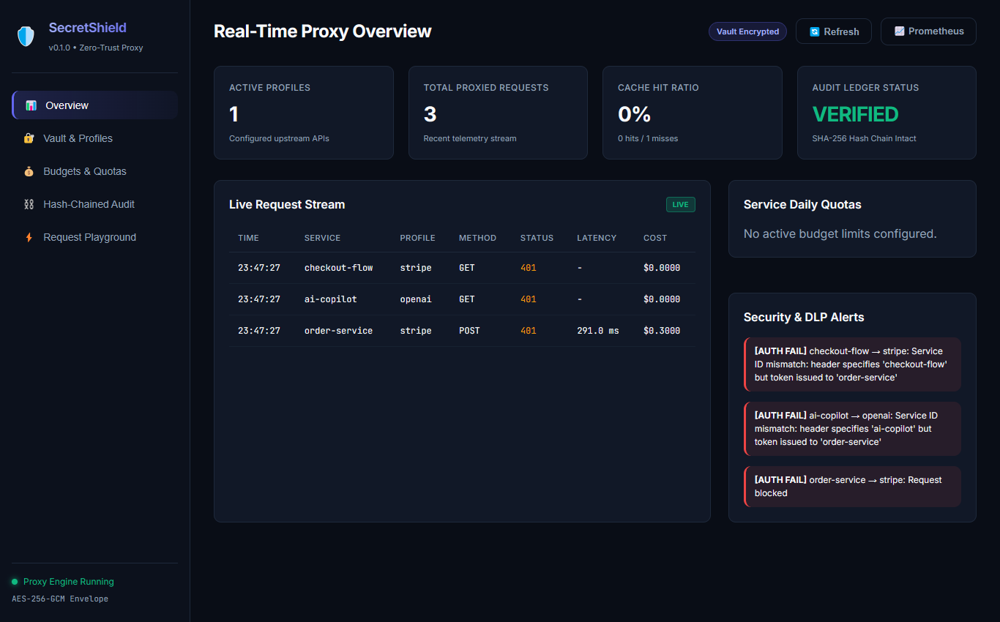
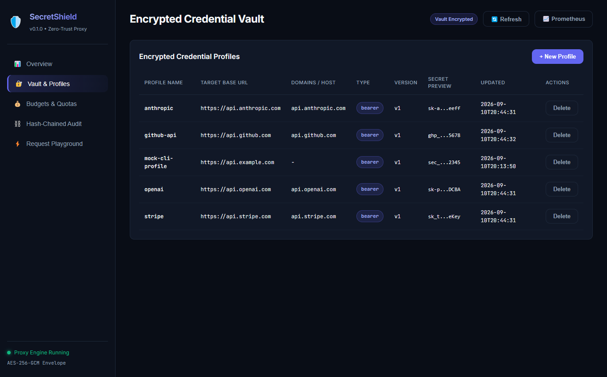
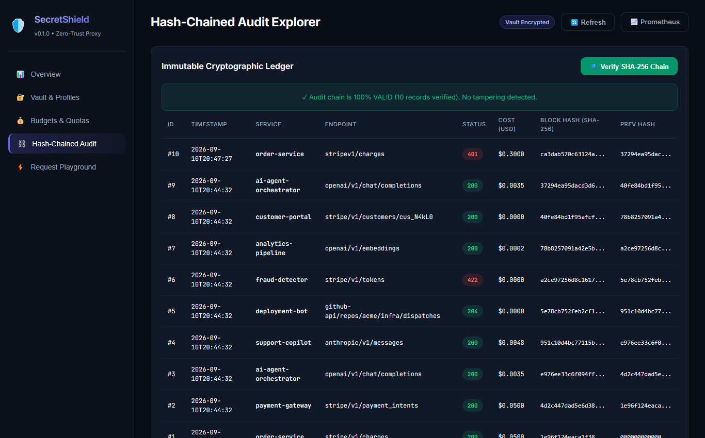

<p align="center">
  
</p>

<h1 align="center">SecretShield</h1>

<p align="center">
  <a href="https://github.com/alexandrmotologa/secretshield/actions"></a>
  <a href="https://github.com/alexandrmotologa/secretshield/blob/main/LICENSE"></a>
  <a href="https://python.org"></a>
  <a href="https://fastapi.tiangolo.com"></a>
  <a href="https://github.com/astral-sh/ruff"></a>
</p>

<p align="center">
  <strong>Zero-Trust outbound credential proxy and dynamic token broker for microservices.</strong>
</p>

## Overview

Microservices often need access to third-party APIs such as Stripe, OpenAI, Anthropic, or AWS. Giving each service direct access to production secrets introduces credential sprawl, risks accidental token leakage in logs, and makes cost tracking difficult.

SecretShield sits between internal services and external APIs. Services make requests to SecretShield using short-lived internal service tokens instead of long-lived external API keys. SecretShield verifies caller identity, enforces permission policies and budget quotas, injects the real encrypted credential into the outbound request, and redacts sensitive data from response logs.

```
+----------------+      Internal Token       +---------------+     Production Key     +------------------+
|  Order Service | ------------------------> |  SecretShield | ---------------------> | api.stripe.com   |
|  (No secrets)  | <------------------------ |  (Redacts PAN)| <--------------------- |                  |
+----------------+       Clean Response      +---------------+     Stripe Response    +------------------+
                                                     |
                                                     v
                                            Hash-Chained Audit Log
```

## Key capabilities

- **Encrypted credential vault**: Stores API secrets encrypted with AES-256-GCM envelope encryption using keys derived via HKDF.
- **Dynamic credential injection**: Automatically injects Bearer tokens, custom HTTP headers, or Basic auth into outbound requests without the caller handling the keys.
- **Transparent forward proxy mode**: Supports standard `HTTP_PROXY` configuration, resolving destination credentials automatically by request `Host` header.
- **Zero-Trust caller authentication**: Validates microservices using short-lived HMAC tokens or pre-shared service IDs.
- **RBAC policy enforcement**: Restricts which services can call specific upstream profiles and HTTP methods.
- **Financial budget limiter**: Tracks spending per service and blocks requests with HTTP 429 when hourly or daily quotas are exceeded.
- **Inbound data loss prevention (DLP)**: Inspects inbound request payloads for credit cards, SSNs, and private tokens in `AUDIT`, `MASK`, or `BLOCK` modes before forwarding upstream.
- **Deterministic response cache**: Caches idempotent upstream responses in memory with SHA-256 canonical request keys to cut latency and API provider costs.
- **High-speed secret redactor**: Masks credit card numbers verified with the Luhn algorithm, API keys, and high-entropy strings from audit logs.
- **Shift-Left repository scanner**: Detects hardcoded credentials, API keys, and high-entropy secrets in source code and PR diffs with actionable SecretShield remediation hints.
- **Standalone GitHub Action**: Reusable CI workflow (`alexandrmotologa/secretshield@v1`) with native GitHub Step Summary and PR annotations to block unencrypted credentials.
- **Hash-chained audit log**: Records request and response metadata into an append-only SQLite ledger where each entry links cryptographically to the previous one.
- **Real-time webhook alerts**: Dispatches instant notifications to Slack, Discord, or generic webhooks when budgets exceed thresholds or circuit breakers trip.
- **Prometheus exporter**: Exposes standard `/metrics` endpoint with counters for requests, latencies, cache hit ratios, and budget spending.
- **Web and terminal dashboards**: Provides both a responsive dark-mode browser console at `/ui/` and an interactive terminal UI.
- **Zero-downtime rotation and portable backups**: Supports blue-green key rotation (`vault rotate`) and encrypted passphrase-protected exports (`vault export`/`vault import`).

## Quickstart

### Installation

Requires Python 3.12 or newer.

```bash
git clone https://github.com/alexandrmotologa/secretshield.git
cd secretshield
uv venv .venv
source .venv/bin/activate  # On Windows: .venv\Scripts\activate
uv pip install -e ".[dev]"
```

### 1. Set a master encryption key

Generate or set a 32-byte hexadecimal master key:

```bash
export SECRETSHIELD_MASTER_KEY=$(python -c "import secrets; print(secrets.token_hex(32))")
```

### 2. Configure an upstream credential profile

Store an API key inside the encrypted vault:

```bash
secretshield vault set stripe \
  --base-url "https://api.stripe.com" \
  --header-name "Authorization" \
  --header-prefix "Bearer " \
  --secret "sk_test_mock_secret_key"
```

### 3. Define an access policy and budget

Authorize the `order-service` to call Stripe with a daily limit:

```bash
secretshield policy set order-service \
  --allowed-profiles "stripe" \
  --daily-budget-usd 50.0 \
  --hourly-budget-usd 10.0
```

### 4. Start the proxy server

Run the proxy with the live dashboard:

```bash
secretshield run --port 8000 --dashboard
```

### 5. Make a proxied request

Clients call SecretShield without needing the Stripe secret:

```bash
curl -X POST http://localhost:8000/proxy/stripe/v1/charges \
  -H "X-Service-Id: order-service" \
  -H "X-Service-Token: <service-token>" \
  -H "Content-Type: application/json" \
  -d '{"amount": 2000, "currency": "usd"}'
```

SecretShield validates the token, verifies budget, injects the real Stripe key, forwards the request, logs the event with card numbers redacted, and returns the response.

### 6. Transparent proxy mode (HTTP_PROXY)

Configure client HTTP libraries to route traffic transparently through SecretShield:

```bash
export HTTP_PROXY="http://localhost:8000"
curl -x http://localhost:8000 https://api.stripe.com/v1/charges \
  -H "X-Service-Id: order-service" \
  -H "X-Service-Token: <service-token>"
```

### 7. Web dashboard and metrics

- Open `http://localhost:8000/ui/` for the real-time web dashboard.
- Scrape `http://localhost:8000/metrics` for Prometheus metrics.

### 8. Key rotation and backups

Perform zero-downtime blue-green secret rotation:

```bash
secretshield vault rotate stripe --secret "sk_test_new_secret_key"
```

Export and import encrypted portable vault snapshots:

```bash
secretshield vault export --output-file backup.json --passphrase "StrongBackupPassphrase123"
secretshield vault import --input-file backup.json --passphrase "StrongBackupPassphrase123"
```

## Shift-Left Repository Scanner

Prevent accidental credential leaks before they reach production. The built-in static scanner checks repositories, modified files, and git pull requests for exposed API keys, private keys, database passwords, and high-entropy secrets.

### CLI Usage

Scan the entire repository:

```bash
secretshield scan .
```

Scan only modified files against the base branch in CI:

```bash
secretshield scan . --against origin/main --format table
```

Supported output formats:
- `table` (default): Formatted Rich console table with masked secrets and remediation commands.
- `json`: Machine-readable JSON output for automated reporting.
- `github`: Markdown table formatted for `$GITHUB_STEP_SUMMARY` plus workflow error annotations.

### GitHub Action Integration

Add SecretShield to `.github/workflows/security.yml` to block pull requests containing raw secrets:

```yaml
name: Security Audit

on:
  pull_request:
    branches: [main]
  push:
    branches: [main]

jobs:
  secret-scan:
    name: SecretShield Hardcoded Secret Gate
    runs-on: ubuntu-latest
    steps:
      - name: Checkout Code
        uses: actions/checkout@v4
        with:
          fetch-depth: 0

      - name: Scan Repository for Secrets
        uses: alexandrmotologa/secretshield@v1
        with:
          against: origin/main
          fail-on-findings: 'true'
```

## Web Dashboard and Telemetry

SecretShield includes a single-page management console mounted directly at `/ui/`. It displays live traffic streams, budget consumption, cache metrics, and tamper verification status.

### Real-Time Proxy Overview


### Encrypted Credential Profiles
Manage upstream profiles, key versions, and domain bindings:


### Immutable Audit Explorer
Inspect and cryptographically verify the SHA-256 hash-chained ledger:


## Architecture

Detailed architectural documentation is available in the `docs/` directory:

- [Architecture and Threat Model](docs/architecture.md)
- [Vault and Envelope Encryption](docs/vault-and-encryption.md)
- [Policy and Budget Enforcement](docs/policy-and-budgets.md)
- [Secret Redaction Engine](docs/redactor.md)

## Development and Testing

Run test suite:

```bash
pytest -v
```

Check code style:

```bash
ruff check .
```

## License

MIT License. See [LICENSE](LICENSE) for details.
